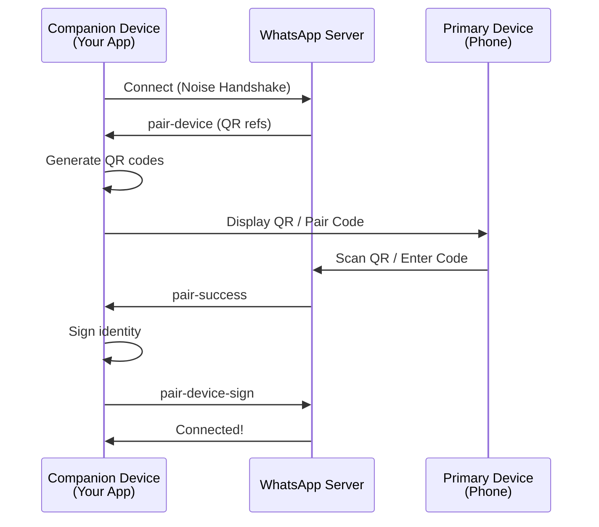

## Overview

WhatsApp-Rust supports two authentication methods for linking companion devices:

1. **QR Code Pairing** - Scan a QR code with your phone
2. **Pair Code (Phone Number Linking)** - Enter an 8-character code on your phone

Both methods use the Noise Protocol for secure key exchange and can run concurrently - whichever completes first wins.

## Authentication Flow



## QR Code Pairing

### How It Works

**Location:** `src/pair.rs`, `wacore/src/pair.rs`

1. **Server sends pairing refs:** After connection, server sends `pair-device` with multiple refs
2. **Generate QR codes:** Each ref becomes a QR code containing device keys
3. **QR rotation:** First code valid for 60s, subsequent codes for 20s each
4. **Phone scans:** User scans QR with WhatsApp > Linked Devices
5. **Crypto handshake:** Noise-based key exchange establishes trust
6. **Completion:** Server sends `pair-success`, device signs identity

### QR Code Contents

```rust
// src/pair.rs
pub fn make_qr_data(store: &Device, ref_str: String) -> String {
    let device_state = DeviceState {
        identity_key: store.identity_key.clone(),
        noise_key: store.noise_key.clone(),
        adv_secret_key: store.adv_secret_key,
    };
    PairUtils::make_qr_data(&device_state, ref_str)
}
```

**QR Format:** `ref,noise_pub,identity_pub,adv_secret`

- `ref`: Pairing reference from server
- `noise_pub`: Static Noise public key (32 bytes, base64)
- `identity_pub`: Signal identity public key (32 bytes, base64)
- `adv_secret`: Advertisement secret key (32 bytes, base64)

### Implementation

```rust
use whatsapp_rust::bot::Bot;
use whatsapp_rust::store::SqliteStore;
use wacore::types::events::Event;

#[tokio::main]
async fn main() -> Result<(), Box<dyn std::error::Error>> {
    let backend = Arc::new(SqliteStore::new("whatsapp.db").await?);

    let mut bot = Bot::builder()
        .with_backend(backend)
        .on_event(|event, _client| async move {
            match event {
                Event::PairingQrCode { code, timeout } => {
                    println!("Scan this QR code (valid for {}s):", timeout.as_secs());
                    println!("{}", code);
                }
                Event::PairSuccess(info) => {
                    println!("✅ Paired as {}", info.id);
                }
                _ => {}
            }
        })
        .build()
        .await?;

    bot.run().await?.await?;
    Ok(())
}
```

### QR Code Events

**Event:** `Event::PairingQrCode`

```rust
// wacore/src/types/events.rs
Event::PairingQrCode {
    code: String,           // ASCII art QR or data string
    timeout: Duration,      // Validity duration (60s first, 20s subsequent)
}
```

**Generated in:** `src/pair.rs:63-97`

```rust
for code in codes_clone {
    let timeout = if is_first {
        is_first = false;
        Duration::from_secs(60)
    } else {
        Duration::from_secs(20)
    };

    client.core.event_bus.dispatch(&Event::PairingQrCode { code, timeout });

    tokio::select! {
        _ = tokio::time::sleep(timeout) => {}
        _ = stop_rx_clone.changed() => {
            info!("Pairing complete. Stopping QR rotation.");
            return;
        }
    }
}
```

## Pair Code (Phone Number Linking)

### How It Works

**Location:** `src/pair_code.rs`, `wacore/src/pair_code.rs`

1. **Generate code:** 8-character Crockford Base32 code
2. **Stage 1 - Hello:** Send phone number + encrypted ephemeral key
3. **Server response:** Returns pairing reference
4. **User enters code:** On phone: WhatsApp > Linked Devices > Link with phone number
5. **Stage 2 - Finish:** Phone confirms, companion sends key bundle
6. **Completion:** Server sends `pair-success`

### Pair Code Format

**Alphabet:** Crockford Base32 (excludes 0, I, O, U)
```
123456789ABCDEFGHJKLMNPQRSTVWXYZ
```

**Length:** Exactly 8 characters

**Example:** `ABCD1234`, `MYCODE12`

### Implementation

#### Random Code

```rust
use whatsapp_rust::pair_code::PairCodeOptions;

let options = PairCodeOptions {
    phone_number: "15551234567".to_string(),
    show_push_notification: true,
    ..Default::default()
};

let code = client.pair_with_code(options).await?;
println!("Enter this code on your phone: {}", code);
```

#### Custom Code

```rust
let options = PairCodeOptions {
    phone_number: "15551234567".to_string(),
    custom_code: Some("MYCODE12".to_string()),
    ..Default::default()
};

let code = client.pair_with_code(options).await?;
assert_eq!(code, "MYCODE12");
```

### Pair Code Options

```rust
// wacore/src/pair_code.rs
pub struct PairCodeOptions {
    /// Phone number in international format (e.g., "15551234567")
    /// Non-digit characters are automatically stripped
    pub phone_number: String,

    /// Whether to show a push notification on the phone
    pub show_push_notification: bool,

    /// Custom 8-character code (must be valid Crockford Base32)
    /// If None, a random code is generated
    pub custom_code: Option<String>,

    /// Platform identifier (default: Chrome)
    pub platform_id: PlatformId,

    /// Platform display name (default: "Chrome")
    pub platform_display: String,
}
```

### Pair Code Events

**Event:** `Event::PairingCode`

```rust
// wacore/src/types/events.rs
Event::PairingCode {
    code: String,           // The 8-character pairing code
    timeout: Duration,      // Validity (~180 seconds)
}
```

**Generated in:** `src/pair_code.rs:215-219`

```rust
self.core.event_bus.dispatch(&Event::PairingCode {
    code: code.clone(),
    timeout: PairCodeUtils::code_validity(),
});
```

### Two-Stage Flow

#### Stage 1: Hello

**Purpose:** Register phone number and encrypted ephemeral key

```rust
// src/pair_code.rs:165-174
let iq_content = PairCodeUtils::build_companion_hello_iq(
    &phone_number,
    &noise_static_pub,
    &wrapped_ephemeral,
    options.platform_id,
    &options.platform_display,
    options.show_push_notification,
    req_id.clone(),
);
```

**Response:** Pairing reference

```rust
let pairing_ref = PairCodeUtils::parse_companion_hello_response(&response)
    .ok_or(PairCodeError::MissingPairingRef)?;
```

#### Stage 2: Finish

**Trigger:** `link_code_companion_reg` notification from server

**Handling:** `src/pair_code.rs:229-376`

```rust
pub(crate) async fn handle_pair_code_notification(client: &Arc<Client>, node: &Node) -> bool {
    // 1. Extract primary's wrapped ephemeral pub (80 bytes)
    // 2. Extract primary's identity pub (32 bytes)
    // 3. Decrypt primary's ephemeral key (expensive PBKDF2)
    // 4. Prepare encrypted key bundle
    // 5. Send companion_finish IQ
}
```

## Cryptography

### Noise Protocol Handshake

**Pattern:** Noise XX (mutual authentication)

```rust
// wacore/noise/
pub struct NoiseHandshake {
    initiator_static: KeyPair,
    ephemeral: KeyPair,
    // ... Noise state machine
}
```

**Flow:**
1. Initiator → Responder: ephemeral pub
2. Responder → Initiator: ephemeral pub, static pub, encrypted payload
3. Initiator → Responder: static pub, encrypted payload

### Key Derivation

**For QR Code:**
```rust
// Direct key exchange - keys in QR code
```

**For Pair Code:**
```rust
// wacore/src/pair_code.rs
// Expensive PBKDF2 operation (wrapped in spawn_blocking)
let wrapped_ephemeral = tokio::task::spawn_blocking(move || {
    PairCodeUtils::encrypt_ephemeral_pub(&ephemeral_pub, &code_clone)
}).await?;
```

**Parameters:**
- **Algorithm:** AES-256-CBC
- **KDF:** PBKDF2-HMAC-SHA256
- **Iterations:** 2^16 (65,536)
- **Salt:** 16 random bytes
- **IV:** 16 random bytes

### Signal Protocol Setup

**After pairing:**
1. Server sends signed device identity
2. Companion verifies signature
3. Identity keys exchanged
4. Pre-keys registered

```rust
// src/pair.rs:188-209
let result = PairUtils::do_pair_crypto(&device_state, &device_identity_bytes);

match result {
    Ok((self_signed_identity_bytes, key_index)) => {
        // Store device JID, LID, account info
        client.persistence_manager
            .process_command(DeviceCommand::SetId(Some(jid.clone())))
            .await;
        client.persistence_manager
            .process_command(DeviceCommand::SetAccount(Some(signed_identity)))
            .await;
    }
    Err(e) => {
        // Send error to server
    }
}
```

## Concurrent Pairing

Both methods can run simultaneously:

```rust
// Start QR code (automatic on connection)
bot.run().await?;

// Also start pair code in parallel
let code = client.pair_with_code(options).await?;
```

**State Management:**
```rust
// src/client.rs
pub(crate) pairing_cancellation_tx: Mutex<Option<watch::Sender<()>>>,
pub(crate) pair_code_state: Mutex<PairCodeState>,
```

**Cancellation:**
```rust
// src/pair.rs:120-127
async fn handle_pair_success(...) {
    // Cancel QR code rotation if active
    if let Some(tx) = client.pairing_cancellation_tx.lock().await.take() {
        let _ = tx.send(());
    }

    // Clear pair code state if active
    *client.pair_code_state.lock().await = PairCodeState::Completed;
}
```

## Success Events

### PairSuccess

```rust
// wacore/src/types/events.rs
#[derive(Debug, Clone, Serialize)]
pub struct PairSuccess {
    pub id: Jid,                // Device JID (e.g., "15551234567.0:1@s.whatsapp.net")
    pub lid: Jid,               // LID JID (e.g., "100000012345678.0:1@lid")
    pub business_name: String,  // Push name / business name
    pub platform: String,       // Platform identifier
}

Event::PairSuccess(PairSuccess { id, lid, business_name, platform })
```

### PairError

```rust
#[derive(Debug, Clone, Serialize)]
pub struct PairError {
    pub id: Jid,
    pub lid: Jid,
    pub business_name: String,
    pub platform: String,
    pub error: String,          // Error description
}

Event::PairError(PairError { /* ... */ })
```

## Error Handling

### QR Code Errors

```rust
// Handled internally, retries with new QR codes
// If all QR codes expire, disconnects:
info!("All QR codes for this session have expired.");
client.disconnect().await;
```

### Pair Code Errors

```rust
use wacore::pair_code::PairCodeError;

match client.pair_with_code(options).await {
    Ok(code) => println!("Code: {}", code),
    Err(PairCodeError::PhoneNumberRequired) => {
        eprintln!("Phone number is required");
    }
    Err(PairCodeError::PhoneNumberTooShort) => {
        eprintln!("Phone number must be at least 7 digits");
    }
    Err(PairCodeError::PhoneNumberNotInternational) => {
        eprintln!("Phone number must not start with 0 (use international format)");
    }
    Err(PairCodeError::InvalidCustomCode) => {
        eprintln!("Custom code must be 8 valid Crockford Base32 characters");
    }
    Err(e) => eprintln!("Pairing failed: {}", e),
}
```

## Session Persistence

### After Successful Pairing

**State saved to storage:**
- Device JID (Phone Number)
- LID (Long-term Identifier)
- Identity keys
- Noise keys
- Registration ID
- Push name

**Next connection:**
```rust
// No pairing needed - automatic reconnection
let bot = Bot::builder()
    .with_backend(backend)
    .build()
    .await?;

bot.run().await?; // Uses saved session
```

### Logout

```rust
// Clear session data
client.logout().await?;

// Event emitted:
Event::LoggedOut(LoggedOut {
    on_connect: false,
    reason: ConnectFailureReason::LoggedOut,
})
```

## Best Practices

### Phone Number Format

<CodeGroup>
```rust ✅ Correct
let options = PairCodeOptions {
    phone_number: "15551234567".to_string(),  // International format
    // Non-digits automatically stripped:
    // phone_number: "+1-555-123-4567".to_string(),
    ..Default::default()
};
```

```rust ❌ Wrong
let options = PairCodeOptions {
    phone_number: "0551234567".to_string(),   // Don't start with 0
    phone_number: "5551234567".to_string(),   // Missing country code
    ..Default::default()
};
```
</CodeGroup>

### Event Handling

```rust
.on_event(|event, client| async move {
    match event {
        Event::PairingQrCode { code, timeout } => {
            // Display QR to user
            println!("Valid for: {}s", timeout.as_secs());
        }
        Event::PairingCode { code, timeout } => {
            // Display code to user
            println!("Enter {} on your phone", code);
        }
        Event::PairSuccess(info) => {
            // Save success notification
            println!("Paired: {}", info.id);
        }
        Event::PairError(err) => {
            // Handle error
            eprintln!("Pairing failed: {}", err.error);
        }
        _ => {}
    }
})
```

### Concurrent Usage

```rust
// Both methods active - whichever completes first wins
tokio::spawn(async move {
    if let Ok(code) = client.pair_with_code(options).await {
        println!("Pair code: {}", code);
    }
});

// QR codes automatically generated and rotated
bot.run().await?;
```

## Related Sections

<CardGroup cols={2}>
  <Card title="Architecture" icon="sitemap" href="/concepts/architecture">
    Understand the project structure
  </Card>
  <Card title="Events" icon="bolt" href="/concepts/events">
    Learn about all event types
  </Card>
  <Card title="Storage" icon="database" href="/concepts/storage">
    Explore session persistence
  </Card>
  <Card title="Quick Start" icon="rocket" href="/quickstart">
    Build your first bot
  </Card>
</CardGroup>