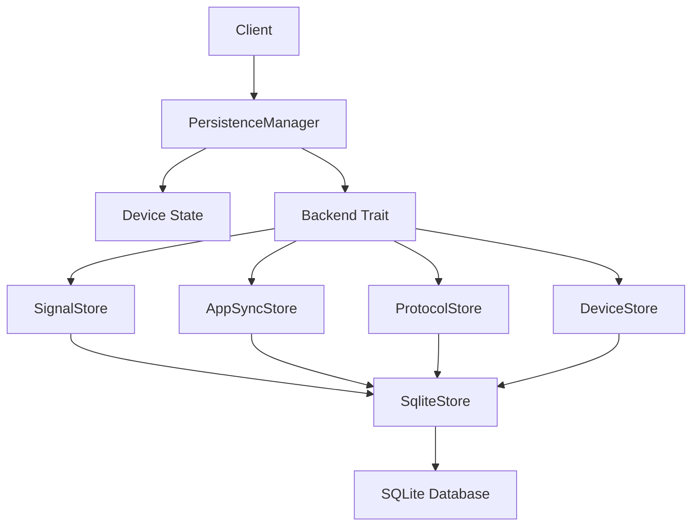

## Overview

WhatsApp-Rust uses a layered storage architecture with pluggable backends. The `PersistenceManager` manages all state changes, while the `Backend` trait defines storage operations for device data, Signal protocol keys, app state sync, and protocol-specific data.

## Architecture



## PersistenceManager

**Location:** `src/store/persistence_manager.rs`

### Purpose

Manages all device state changes and persistence operations. Acts as the gatekeeper for state modifications.

### Structure

```rust
pub struct PersistenceManager {
    device: Arc<RwLock<Device>>,
    backend: Arc<dyn Backend>,
    dirty: Arc<AtomicBool>,
    save_notify: Arc<Notify>,
}
```

**Fields:**
- `device`: In-memory device state (protected by RwLock)
- `backend`: Storage backend implementation
- `dirty`: Flag indicating unsaved changes
- `save_notify`: Notification channel for background saver

### Initialization

```rust
impl PersistenceManager {
    pub async fn new(backend: Arc<dyn Backend>) -> Result<Self, StoreError> {
        // Ensure device row exists
        let exists = backend.exists().await?;
        if !exists {
            backend.create().await?;
        }

        // Load existing data or create new
        let device_data = backend.load().await?;
        let device = if let Some(data) = device_data {
            let mut dev = Device::new(backend.clone());
            dev.load_from_serializable(data);
            dev
        } else {
            Device::new(backend.clone())
        };

        Ok(Self {
            device: Arc::new(RwLock::new(device)),
            backend,
            dirty: Arc::new(AtomicBool::new(false)),
            save_notify: Arc::new(Notify::new()),
        })
    }
}
```

### Key Methods

#### get_device_snapshot

**Purpose:** Read-only access to device state

```rust
pub async fn get_device_snapshot(&self) -> Device {
    self.device.read().await.clone()
}
```

**Usage:**
```rust
let device = client.persistence_manager.get_device_snapshot().await;
println!("Device ID: {:?}", device.pn);
println!("Push Name: {}", device.push_name);
```

#### modify_device

**Purpose:** Modify device state with automatic dirty tracking

```rust
pub async fn modify_device<F, R>(&self, modifier: F) -> R
where
    F: FnOnce(&mut Device) -> R,
{
    let mut device_guard = self.device.write().await;
    let result = modifier(&mut device_guard);

    self.dirty.store(true, Ordering::Relaxed);
    self.save_notify.notify_one();

    result
}
```

**Usage:**
```rust
client.persistence_manager.modify_device(|device| {
    device.push_name = "New Name".to_string();
}).await;
```

#### process_command

**Purpose:** Apply state changes via `DeviceCommand`

```rust
pub async fn process_command(&self, command: DeviceCommand) {
    self.modify_device(|device| {
        apply_command_to_device(device, command);
    }).await;
}
```

**Usage:**
```rust
client.persistence_manager
    .process_command(DeviceCommand::SetPushName("New Name".to_string()))
    .await;
```

### Background Saver

**Purpose:** Periodically persist dirty state to disk

```rust
pub fn run_background_saver(self: Arc<Self>, interval: Duration) {
    tokio::spawn(async move {
        loop {
            tokio::select! {
                _ = self.save_notify.notified() => {
                    debug!("Save notification received.");
                }
                _ = sleep(interval) => {}
            }

            if let Err(e) = self.save_to_disk().await {
                error!("Error saving device state: {e}");
            }
        }
    });
}

async fn save_to_disk(&self) -> Result<(), StoreError> {
    if self.dirty.swap(false, Ordering::AcqRel) {
        let device_guard = self.device.read().await;
        let serializable_device = device_guard.to_serializable();
        drop(device_guard);

        self.backend.save(&serializable_device).await?;
    }
    Ok(())
}
```

**Behavior:**
- Wakes up when notified or after interval
- Only saves if dirty flag is set
- Uses optimistic locking (dirty flag)

**Start background saver:**
```rust
let persistence_manager = Arc::new(PersistenceManager::new(backend).await?);
persistence_manager.clone().run_background_saver(Duration::from_secs(5));
```

## Backend Trait

**Location:** `wacore/src/store/traits.rs`

### Overview

The `Backend` trait is automatically implemented for any type that implements all four domain-specific traits:

```rust
pub trait Backend: SignalStore + AppSyncStore + ProtocolStore + DeviceStore + Send + Sync {}
```

### Domain Traits

## SignalStore

**Purpose:** Signal protocol cryptographic operations

```rust
#[async_trait]
pub trait SignalStore: Send + Sync {
    // Identity Operations
    async fn put_identity(&self, address: &str, key: [u8; 32]) -> Result<()>;
    async fn load_identity(&self, address: &str) -> Result<Option<Vec<u8>>>;
    async fn delete_identity(&self, address: &str) -> Result<()>;

    // Session Operations
    async fn get_session(&self, address: &str) -> Result<Option<Vec<u8>>>;
    async fn put_session(&self, address: &str, session: &[u8]) -> Result<()>;
    async fn delete_session(&self, address: &str) -> Result<()>;
    async fn has_session(&self, address: &str) -> Result<bool>;

    // PreKey Operations
    async fn store_prekey(&self, id: u32, record: &[u8], uploaded: bool) -> Result<()>;
    async fn load_prekey(&self, id: u32) -> Result<Option<Vec<u8>>>;
    async fn remove_prekey(&self, id: u32) -> Result<()>;

    // Signed PreKey Operations
    async fn store_signed_prekey(&self, id: u32, record: &[u8]) -> Result<()>;
    async fn load_signed_prekey(&self, id: u32) -> Result<Option<Vec<u8>>>;
    async fn load_all_signed_prekeys(&self) -> Result<Vec<(u32, Vec<u8>)>>;
    async fn remove_signed_prekey(&self, id: u32) -> Result<()>;

    // Sender Key Operations (for groups)
    async fn put_sender_key(&self, address: &str, record: &[u8]) -> Result<()>;
    async fn get_sender_key(&self, address: &str) -> Result<Option<Vec<u8>>>;
    async fn delete_sender_key(&self, address: &str) -> Result<()>;
}
```

**Usage Example:**
```rust
// Store identity key for a contact
backend.put_identity(
    "15551234567@s.whatsapp.net:0",
    identity_key
).await?;

// Load session for decryption
if let Some(session) = backend.get_session("15551234567@s.whatsapp.net:0").await? {
    // Decrypt message using session
}
```

## AppSyncStore

**Purpose:** WhatsApp app state synchronization

```rust
#[async_trait]
pub trait AppSyncStore: Send + Sync {
    // Sync Keys
    async fn get_sync_key(&self, key_id: &[u8]) -> Result<Option<AppStateSyncKey>>;
    async fn set_sync_key(&self, key_id: &[u8], key: AppStateSyncKey) -> Result<()>;

    // Version Tracking
    async fn get_version(&self, name: &str) -> Result<HashState>;
    async fn set_version(&self, name: &str, state: HashState) -> Result<()>;

    // Mutation MACs
    async fn put_mutation_macs(
        &self,
        name: &str,
        version: u64,
        mutations: &[AppStateMutationMAC],
    ) -> Result<()>;
    async fn get_mutation_mac(&self, name: &str, index_mac: &[u8]) -> Result<Option<Vec<u8>>>;
    async fn delete_mutation_macs(&self, name: &str, index_macs: &[Vec<u8>]) -> Result<()>;
}
```

**AppStateSyncKey Structure:**
```rust
#[derive(Debug, Clone, Default, Serialize, Deserialize)]
pub struct AppStateSyncKey {
    pub key_data: Vec<u8>,
    pub fingerprint: Vec<u8>,
    pub timestamp: i64,
}
```

**Collections:**
- `critical_block` - Blocked contacts
- `regular` - Chat settings (pin, mute, archive)
- `regular_high` - Contact info, push names
- `regular_low` - Chat messages metadata

## ProtocolStore

**Purpose:** WhatsApp Web protocol-specific storage

```rust
#[async_trait]
pub trait ProtocolStore: Send + Sync {
    // SKDM Tracking (Sender Key Distribution Messages)
    async fn get_skdm_recipients(&self, group_jid: &str) -> Result<Vec<Jid>>;
    async fn add_skdm_recipients(&self, group_jid: &str, device_jids: &[Jid]) -> Result<()>;
    async fn clear_skdm_recipients(&self, group_jid: &str) -> Result<()>;

    // LID-PN Mapping (Long-term ID to Phone Number)
    async fn get_lid_mapping(&self, lid: &str) -> Result<Option<LidPnMappingEntry>>;
    async fn get_pn_mapping(&self, phone: &str) -> Result<Option<LidPnMappingEntry>>;
    async fn put_lid_mapping(&self, entry: &LidPnMappingEntry) -> Result<()>;
    async fn get_all_lid_mappings(&self) -> Result<Vec<LidPnMappingEntry>>;

    // Base Key Collision Detection
    async fn save_base_key(&self, address: &str, message_id: &str, base_key: &[u8]) -> Result<()>;
    async fn has_same_base_key(&self, address: &str, message_id: &str, current_base_key: &[u8]) -> Result<bool>;
    async fn delete_base_key(&self, address: &str, message_id: &str) -> Result<()>;

    // Device Registry
    async fn update_device_list(&self, record: DeviceListRecord) -> Result<()>;
    async fn get_devices(&self, user: &str) -> Result<Option<DeviceListRecord>>;

    // Sender Key Status (Lazy Deletion)
    async fn mark_forget_sender_key(&self, group_jid: &str, participant: &str) -> Result<()>;
    async fn consume_forget_marks(&self, group_jid: &str) -> Result<Vec<String>>;

    // TcToken Storage (Trusted Contact Tokens)
    async fn get_tc_token(&self, jid: &str) -> Result<Option<TcTokenEntry>>;
    async fn put_tc_token(&self, jid: &str, entry: &TcTokenEntry) -> Result<()>;
    async fn delete_tc_token(&self, jid: &str) -> Result<()>;
    async fn get_all_tc_token_jids(&self) -> Result<Vec<String>>;
    async fn delete_expired_tc_tokens(&self, cutoff_timestamp: i64) -> Result<u32>;
}
```

**LidPnMappingEntry:**
```rust
#[derive(Debug, Clone, Serialize, Deserialize)]
pub struct LidPnMappingEntry {
    pub lid: String,
    pub phone_number: String,
    pub created_at: i64,
    pub updated_at: i64,
    pub learning_source: String,
}
```

**DeviceListRecord:**
```rust
#[derive(Debug, Clone, Serialize, Deserialize)]
pub struct DeviceListRecord {
    pub user: String,
    pub devices: Vec<DeviceInfo>,
    pub timestamp: i64,
    pub phash: Option<String>,
}

#[derive(Debug, Clone, Serialize, Deserialize)]
pub struct DeviceInfo {
    pub device_id: u32,
    pub key_index: Option<u32>,
}
```

**TcTokenEntry:**
```rust
#[derive(Debug, Clone, Serialize, Deserialize)]
pub struct TcTokenEntry {
    pub token: Vec<u8>,
    pub token_timestamp: i64,
    pub sender_timestamp: Option<i64>,
}
```

## DeviceStore

**Purpose:** Device data persistence

```rust
#[async_trait]
pub trait DeviceStore: Send + Sync {
    async fn save(&self, device: &Device) -> Result<()>;
    async fn load(&self) -> Result<Option<Device>>;
    async fn exists(&self) -> Result<bool>;
    async fn create(&self) -> Result<i32>;
    async fn snapshot_db(&self, _name: &str, _extra_content: Option<&[u8]>) -> Result<()>;
}
```

**Device Structure:**
```rust
// wacore/src/store/device.rs
#[derive(Clone, Serialize, Deserialize)]
pub struct Device {
    pub pn: Option<Jid>,                    // Phone number JID
    pub lid: Option<Jid>,                   // Long-term identifier
    pub push_name: String,                  // Display name
    pub platform: String,                   // Platform identifier
    pub registration_id: u32,               // Signal registration ID
    pub adv_secret_key: [u8; 32],          // Advertisement secret
    pub identity_key: KeyPair,              // Signal identity keypair
    pub noise_key: KeyPair,                 // Noise protocol keypair
    pub account: Option<wa::AdvSignedDeviceIdentity>,
    // ... more fields
}
```

## SqliteStore Implementation

**Location:** `storages/sqlite-storage/src/lib.rs`

### Database Schema

```sql
-- Device table
CREATE TABLE device (
    device_id INTEGER PRIMARY KEY AUTOINCREMENT,
    data BLOB NOT NULL
);

-- Signal protocol tables
CREATE TABLE identities (
    device_id INTEGER NOT NULL,
    address TEXT NOT NULL,
    key BLOB NOT NULL,
    PRIMARY KEY (device_id, address)
);

CREATE TABLE sessions (
    device_id INTEGER NOT NULL,
    address TEXT NOT NULL,
    record BLOB NOT NULL,
    PRIMARY KEY (device_id, address)
);

CREATE TABLE prekeys (
    device_id INTEGER NOT NULL,
    prekey_id INTEGER NOT NULL,
    record BLOB NOT NULL,
    uploaded BOOLEAN NOT NULL,
    PRIMARY KEY (device_id, prekey_id)
);

CREATE TABLE signed_prekeys (
    device_id INTEGER NOT NULL,
    signed_prekey_id INTEGER NOT NULL,
    record BLOB NOT NULL,
    PRIMARY KEY (device_id, signed_prekey_id)
);

CREATE TABLE sender_keys (
    device_id INTEGER NOT NULL,
    address TEXT NOT NULL,
    record BLOB NOT NULL,
    PRIMARY KEY (device_id, address)
);

-- App state sync tables
CREATE TABLE app_state_sync_keys (
    device_id INTEGER NOT NULL,
    key_id BLOB NOT NULL,
    key_data BLOB NOT NULL,
    fingerprint BLOB NOT NULL,
    timestamp INTEGER NOT NULL,
    PRIMARY KEY (device_id, key_id)
);

CREATE TABLE app_state_versions (
    device_id INTEGER NOT NULL,
    name TEXT NOT NULL,
    version INTEGER NOT NULL,
    hash BLOB,
    PRIMARY KEY (device_id, name)
);

CREATE TABLE app_state_mutation_macs (
    device_id INTEGER NOT NULL,
    name TEXT NOT NULL,
    version INTEGER NOT NULL,
    index_mac BLOB NOT NULL,
    value_mac BLOB NOT NULL,
    PRIMARY KEY (device_id, name, version, index_mac)
);

-- Protocol tables
CREATE TABLE skdm_recipients (
    device_id INTEGER NOT NULL,
    group_jid TEXT NOT NULL,
    device_jid TEXT NOT NULL,
    timestamp INTEGER NOT NULL,
    PRIMARY KEY (device_id, group_jid, device_jid)
);

CREATE TABLE lid_pn_mappings (
    device_id INTEGER NOT NULL,
    lid TEXT NOT NULL,
    phone_number TEXT NOT NULL,
    created_at INTEGER NOT NULL,
    updated_at INTEGER NOT NULL,
    learning_source TEXT NOT NULL,
    PRIMARY KEY (device_id, lid)
);

CREATE TABLE device_lists (
    device_id INTEGER NOT NULL,
    user TEXT NOT NULL,
    devices BLOB NOT NULL,
    timestamp INTEGER NOT NULL,
    phash TEXT,
    PRIMARY KEY (device_id, user)
);

CREATE TABLE tc_tokens (
    device_id INTEGER NOT NULL,
    jid TEXT NOT NULL,
    token BLOB NOT NULL,
    token_timestamp INTEGER NOT NULL,
    sender_timestamp INTEGER,
    PRIMARY KEY (device_id, jid)
);
```

### Multi-Account Support

**Each device has unique `device_id`:**

```rust
use whatsapp_rust::store::SqliteStore;

// Account 1
let backend1 = Arc::new(SqliteStore::new_for_device("whatsapp.db", 1).await?);
let pm1 = PersistenceManager::new(backend1).await?;

// Account 2
let backend2 = Arc::new(SqliteStore::new_for_device("whatsapp.db", 2).await?);
let pm2 = PersistenceManager::new(backend2).await?;
```

**All tables scoped by `device_id`:**
```sql
SELECT * FROM sessions WHERE device_id = 1 AND address = ?;
```

## DeviceCommand Pattern

**Location:** `src/store/commands.rs`, `wacore/src/store/commands.rs`

### Purpose

Provide type-safe, centralized state mutations.

### Command Enum

```rust
pub enum DeviceCommand {
    SetId(Option<Jid>),
    SetLid(Option<Jid>),
    SetPushName(String),
    SetPlatform(String),
    SetAccount(Option<wa::AdvSignedDeviceIdentity>),
    // ... more commands
}
```

### Command Application

```rust
pub fn apply_command_to_device(device: &mut Device, command: DeviceCommand) {
    match command {
        DeviceCommand::SetId(id) => {
            device.pn = id;
        }
        DeviceCommand::SetLid(lid) => {
            device.lid = lid;
        }
        DeviceCommand::SetPushName(name) => {
            device.push_name = name;
        }
        DeviceCommand::SetPlatform(platform) => {
            device.platform = platform;
        }
        DeviceCommand::SetAccount(account) => {
            device.account = account;
        }
        // ...
    }
}
```

### Usage

```rust
// ✅ Correct: Use DeviceCommand
client.persistence_manager
    .process_command(DeviceCommand::SetPushName("New Name".to_string()))
    .await;

// ❌ Wrong: Direct modification
let mut device = client.device.write().await;
device.push_name = "New Name".to_string(); // DON'T DO THIS
```

## State Management Best Practices

### Read-Only Access

```rust
// Cheap snapshot for read-only access
let device = client.persistence_manager.get_device_snapshot().await;
println!("JID: {:?}", device.pn);
```

### Modifications

```rust
// Use process_command for type-safe mutations
client.persistence_manager
    .process_command(DeviceCommand::SetPushName(name))
    .await;
```

### Bulk Operations

```rust
// Use modify_device for multiple changes
client.persistence_manager.modify_device(|device| {
    device.push_name = "New Name".to_string();
    device.platform = "Chrome".to_string();
}).await;
```

### Critical Errors

```rust
// Create snapshot for debugging crypto failures
client.persistence_manager
    .create_snapshot("decrypt_failure", Some(&failed_message_bytes))
    .await?;
```

## Custom Backend Implementation

### Example: PostgreSQL Backend

```rust
use async_trait::async_trait;
use wacore::store::traits::*;

pub struct PostgresStore {
    pool: sqlx::PgPool,
    device_id: i32,
}

#[async_trait]
impl SignalStore for PostgresStore {
    async fn put_identity(&self, address: &str, key: [u8; 32]) -> Result<()> {
        sqlx::query(
            "INSERT INTO identities (device_id, address, key) 
             VALUES ($1, $2, $3) 
             ON CONFLICT (device_id, address) DO UPDATE SET key = $3"
        )
        .bind(self.device_id)
        .bind(address)
        .bind(&key[..])
        .execute(&self.pool)
        .await?;
        Ok(())
    }

    // ... implement other methods
}

#[async_trait]
impl AppSyncStore for PostgresStore {
    // ... implement methods
}

#[async_trait]
impl ProtocolStore for PostgresStore {
    // ... implement methods
}

#[async_trait]
impl DeviceStore for PostgresStore {
    // ... implement methods
}

// Backend trait automatically implemented
```

### Usage

```rust
let backend = Arc::new(PostgresStore::new(pool, device_id));
let pm = PersistenceManager::new(backend).await?;
```

## Migration & Debugging

### Database Snapshots

**Feature flag:** `debug-snapshots`

```toml
[dependencies]
whatsapp-rust = { version = "0.2", features = ["debug-snapshots"] }
```

**Usage:**
```rust
// Trigger snapshot on critical errors
if let Err(e) = decrypt_message(&msg).await {
    client.persistence_manager
        .create_snapshot(
            &format!("decrypt_failure_{}", msg.id),
            Some(&serialized_message)
        )
        .await?;
    return Err(e);
}
```

**Output:**
```
snapshots/
├── decrypt_failure_1234567890_whatsapp.db
└── decrypt_failure_1234567890_extra.bin
```

## Related Sections

<CardGroup cols={2}>
  <Card title="Architecture" icon="sitemap" href="/concepts/architecture">
    Understand PersistenceManager's role
  </Card>
  <Card title="Authentication" icon="key" href="/concepts/authentication">
    Learn how session data is persisted
  </Card>
  <Card title="Custom Backends" icon="plug" href="/guides/custom-backends">
    Implement your own storage backend
  </Card>
  <Card title="Storage API" icon="code" href="/api/store">
    Complete storage API reference
  </Card>
</CardGroup>